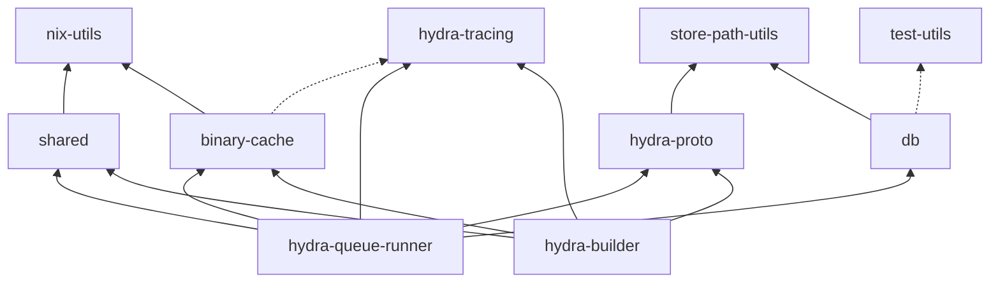

# Architecture

This is an overview of Hydra's inner workings.
You can use it as a guide to navigate the codebase or ask questions.

## Components

Hydra's components are split across a coordinator machine and any number of builder machines.
The NixOS modules in `nixos-modules/` reflect this split: `web-app` and `queue-runner` run on the master, while `builder` runs on remote machines.
For small installations, all three can run on a single host (the `hydra` module combines them).
But most installation will want to use multiple build machines for scale.

### Coordinator machine

These components all share a single Nix store and PostgreSQL database on the master:

- **PostgreSQL database**
    - stores configuration, the build queue (scheduled and finished builds), and results
- **`hydra-server`** (Perl, Catalyst)
    - web frontend and REST API
    - user authentication (built-in or LDAP)
- **`hydra-evaluator`** (C++)
    - periodically evaluates jobsets by invoking the Nix evaluator
    - writes `.drv` files into the coordinator's Nix store
    - adds new builds to the queue when evaluation results change
- **`hydra-eval-jobset`** (Perl)
    - called by the evaluator to orchestrate fetching inputs and running the Nix evaluation
- **`hydra-queue-runner`** (Rust)
    - reads `.drv` files from the coordinator's Nix store
    - schedules build steps across builders
    - uploads results to a destination store
    - exposes a gRPC service that builders connect to
- **`hydra-notify`** (Perl)
    - dispatches post-build notifications to plugins (email, GitHub/GitLab status, Slack, etc.)
    - listens for PostgreSQL `NOTIFY` events from the queue runner
- **Plugin system** (Perl)
    - input plugins extend the evaluator with new source types (Git, Mercurial, Darcs, etc.)
    - notification plugins react to build lifecycle events

### Destination store

The queue runner uploads built outputs to a *destination store*, which is separate from the coordinator's local Nix store.
This can be an S3-compatible binary cache, or for small installations it can just be the coordinator's own store.
See [Populating a Cache](configuration.md#populating-a-cache) for configuration.

### Builder machines

Builders have their own Nix store — they do not need access to the coordinator's store or database.

- **`hydra-builder`** (Rust)
    - build execution agent that runs on remote machines
    - connects to the queue runner's gRPC service
    - receives derivations to build, streams back logs and results

## Rust crate dependencies

The following is the [transitive reduction](https://en.wikipedia.org/wiki/Transitive_reduction) of the dependency graph between the Rust crates in this repo.
Solid arrows are normal dependencies; dashed arrows are dev (test-only) dependencies.

<!-- Regenerate with: python3 scripts/dependency-diagram.py --update -->

### Shared Rust libraries

- `proto` — generated gRPC/protobuf code for the builder ↔ queue-runner interface (message types, client stubs, server traits)
- `db` — PostgreSQL database access via SQLx (models, queries, connection pooling)
- `binary-cache` — reading and writing Nix binary cache artifacts (NARinfo, NAR files, signatures, presigned uploads)
- `nix-utils` — Nix store path parsing, derivation reading, and local store operations
- `shared` — common types used across components (protobuf newtypes, `nix-support` file parsing)
- `store-path-utils` — lightweight store path utilities built on harmonia types
- `tracing` — OpenTelemetry/tracing setup with optional gRPC export
- `test-utils` — test fixtures and helpers for integration tests

## Source layout

The repository is organized into subprojects:

- [`subprojects/hydra/`](https://github.com/NixOS/hydra/tree/master/subprojects/hydra)
  — the Perl/Catalyst web application, evaluator scripts, SQL schema, and plugins
- [`subprojects/hydra-queue-runner/`](https://github.com/NixOS/hydra/tree/master/subprojects/hydra-queue-runner)
  — the Rust queue runner
- [`subprojects/hydra-builder/`](https://github.com/NixOS/hydra/tree/master/subprojects/hydra-builder)
  — the Rust build agent
- [`subprojects/crates/`](https://github.com/NixOS/hydra/tree/master/subprojects/crates)
  — shared Rust libraries
- [`subprojects/proto/`](https://github.com/NixOS/hydra/tree/master/subprojects/proto)
  — Protocol Buffer `.proto` source files (compiled by the `proto` crate's build script)
- [`subprojects/nix-perl/`](https://github.com/NixOS/hydra/tree/master/subprojects/nix-perl)
  — Perl bindings to the Nix store API
- [`subprojects/hydra-tests/`](https://github.com/NixOS/hydra/tree/master/subprojects/hydra-tests)
  — integration test suite (Perl, using `Test::More`)
- [`subprojects/hydra-manual/`](https://github.com/NixOS/hydra/tree/master/subprojects/hydra-manual)
  — this manual (mdbook)

The build system uses Meson for the C++ and Perl components and Cargo for the Rust workspace.

## Database Schema

The canonical schema lives in [`subprojects/hydra/sql/hydra.sql`](https://github.com/NixOS/hydra/blob/master/subprojects/hydra/sql/hydra.sql).
Incremental migrations are in `migrations/upgrade-N.sql`; see the [SQL README](https://github.com/NixOS/hydra/blob/master/subprojects/hydra/sql/README.md) for details on making schema changes.

The database is accessed by all three language runtimes: Perl (DBI/DBIx::Class), C++ (libpqxx), and Rust (SQLx).

Key tables:

- `Jobsets`
    - populated by calling Nix evaluator
    - every Nix derivation in `release.nix` is a Job
    - `flake`
        - URL to flake, if job is from a flake
        - single-point of configuration for flake builds
        - flake itself contains pointers to dependencies
        - for other builds we need more configuration data
- `JobsetInputs`
    - more configuration for a Job
- `JobsetInputAlts`
    - historical, where you could have more than one alternative for each input
    - it would have done the cross product of all possibilities
    - not used any more, as now every input is unique
    - originally that was to have alternative values for the system parameter
        - `x86-linux`, `x86_64-darwin`
        - turned out not to be a good idea, as job set names did not uniquely identify output
- `Builds`
    - queue: scheduled and finished builds
    - instance of a Job
    - corresponds to a top-level derivation
        - can have many dependencies that don’t have a corresponding build
        - dependencies represented as `BuildSteps`
    - a Job is all the builds with a particular name, e.g.
        - `git.x86_64-linux` is a job
        - there maybe be multiple builds for that job
            - build ID: just an auto-increment number
    - building one thing can actually cause many (hundreds of) derivations to be built
    - for queued builds, the `drv` has to be present in the store
        - otherwise build will fail, e.g. after garbage collection
- `BuildSteps`
    - corresponds to a derivation or substitution
    - are reused through the Nix store
    - may be duplicated for unique derivations due to how they relate to `Jobs`
- `BuildStepOutputs`
    - corresponds directly to derivation outputs
        - `out`, `dev`, ...
- `BuildProducts`
    - not a Nix concept
    - populated from a special file `$out/nix-support/hydra-build-products`
    - used to scrape parts of build results out to the web frontend
        - e.g. manuals, ISO images, etc.
- `BuildMetrics`
    - scrapes data from magic location, similar to `BuildProducts` to show fancy graphs
        - e.g. test coverage, build times, CPU utilization for build
    - `$out/nix-support/hydra-metrics`
- `BuildInputs`
    - probably obsolete
- `JobsetEvalMembers`
    - joins evaluations with jobs
    - huge table, 10k’s of entries for one `nixpkgs` evaluation
    - can be imagined as a subset of the eval cache
        - could in principle use the eval cache

## `release.nix`

- hydra-specific convention to describe the build
- should evaluate to an attribute set that contains derivations
- hydra considers every attribute in that set a job
- every job needs a unique name
    - if you want to build for multiple platforms, you need to reflect that in the name
- hydra does a deep traversal of the attribute set
    - just evaluating the names may take half an hour

## FAQ

Can we imagine Hydra to be a persistence layer for the build graph?

- partially, it lacks a lot of information
  - does not keep edges of the build graph

How does Hydra relate to `nix build`?

- reimplements the top level Nix build loop, scheduling, etc.
- Hydra has to persist build results
- Hydra has more sophisticated remote build execution and scheduling than Nix

Is it conceptually possible to unify Hydra’s capabilities with regular Nix?

- Nix does not have any scheduling, it just traverses the build graph
- Hydra has scheduling in terms of job set priorities, tracks how much of a job set it has worked on
    - makes sure jobs don’t starve each other
- Both Hydra and Nix can dynamically add build jobs at runtime
    - Hydra queued up new jobs dynamically / on-line long before Nix.
    - But now, both Nix and Hydra now have experimental support for [dynamic derivations](https://github.com/NixOS/rfcs/blob/master/rfcs/0092-plan-dynamism.md), where build jobs can produce new derivations at build time
- Hydra queue runner is a long running process
    - Nix takes a static set of jobs, working it off at once
